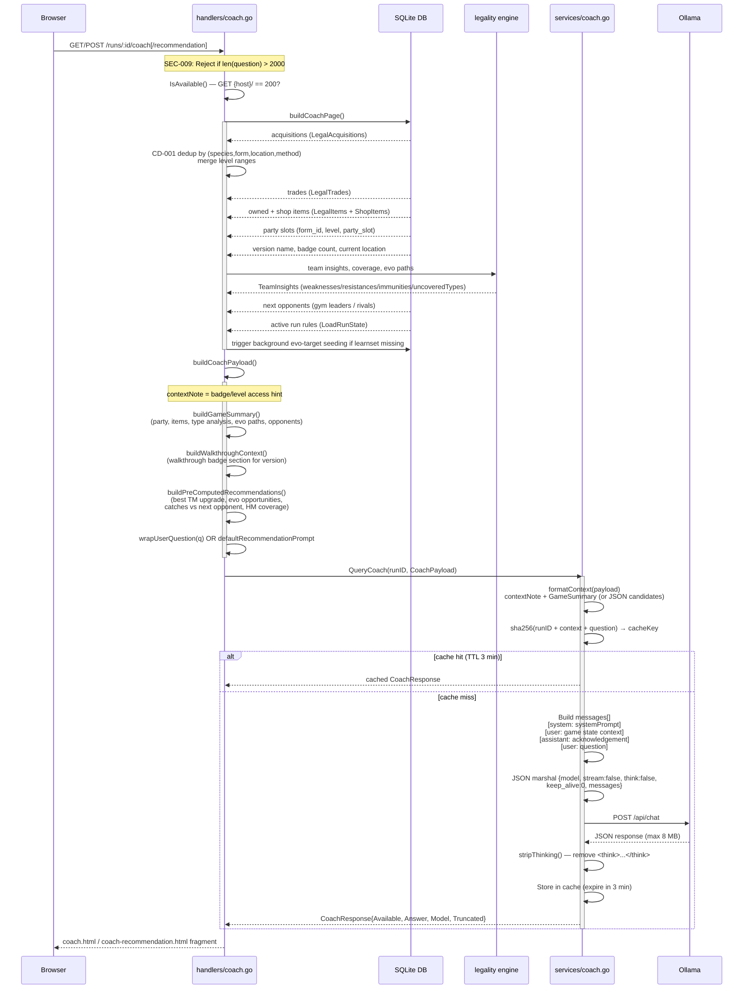

# Coach → Ollama Request Flow

End-to-end sequence showing how a browser request becomes an Ollama API call, including all pre-processing steps.

## Pre-processing summary

### Stage 1 — `buildCoachPage` (DB queries)
- Loads legal acquisitions → deduplicates by `(species, form, location, method)` merging level ranges (CD-001)
- Loads trades, owned items + shop items (sorted by source/category)
- Loads party slots with form/level, version name, badge count, current location
- Runs legality engine for type coverage, weaknesses/resistances, evolution paths
- Loads next opponents and active run rules
- Triggers background seeding for any evo-target missing learnset data

### Stage 2 — `buildCoachPayload` (prompt assembly)
- `buildGameSummary` — structured text of party, items, type analysis, evo paths, opponents
- `buildWalkthroughContext` — pulls the relevant walkthrough section for the player's version + badge progress
- `buildPreComputedRecommendations` — server-side verified facts (best TM upgrade, evo opportunities, optimal catches vs next opponent) so the LLM presents data, not hallucinations
- Wraps user question via `wrapUserQuestion()` or uses `defaultRecommendationPrompt`

### Stage 3 — `QueryCoach` (cache + send)
- `formatContext` serializes context note + GameSummary (or JSON fallback)
- SHA-256 cache check (3-min TTL, max 256 entries)
- Builds 4-turn message array: `system → user (game state) → assistant (ack) → user (question)`
- Sends with `keep_alive:0`, `stream:false`, `think:false`
- Response stripped of `<think>...</think>` blocks, capped at 8 MB
